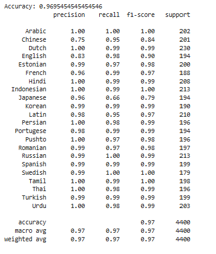

# ​ Language Detection AI with Interactive Visualizations

This project trains a RidgeClassifier to detect the language of text and showcases interactive Plotly visualizations.

---

##  Visual Highlights

### Distribution by Language


### Model Metrics


### Prediction Confidence


### Top Words in English


### Confusion Matrix


---

##  Files Included

- `main.py` – Combines model training and interactive Plotly charts
- `language_detection.csv` – Dataset used for training
- `requirements.txt` – Dependencies required to run the project

---

## ​ How to Run

1. **Clone the repository**
   ```bash
   git clone https://github.com/your‑username/language-detection.git
   cd language-detection
